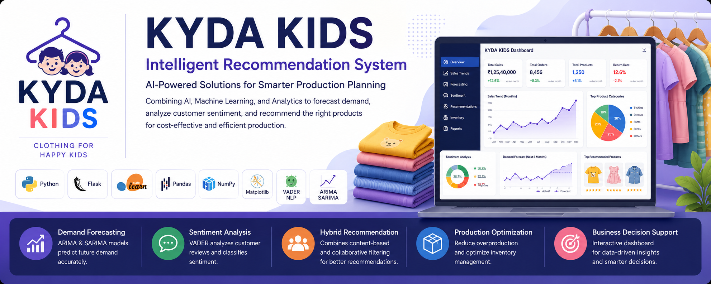
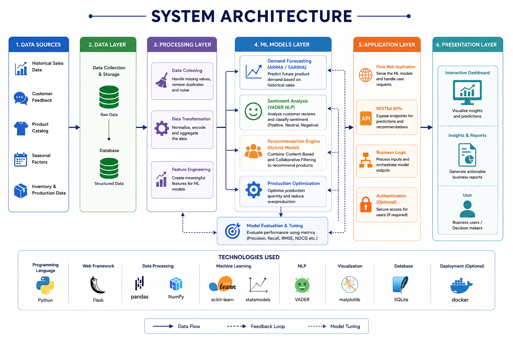
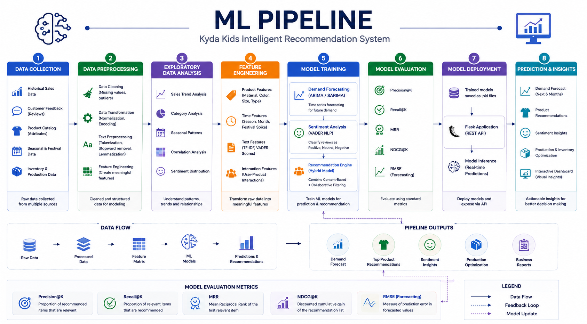
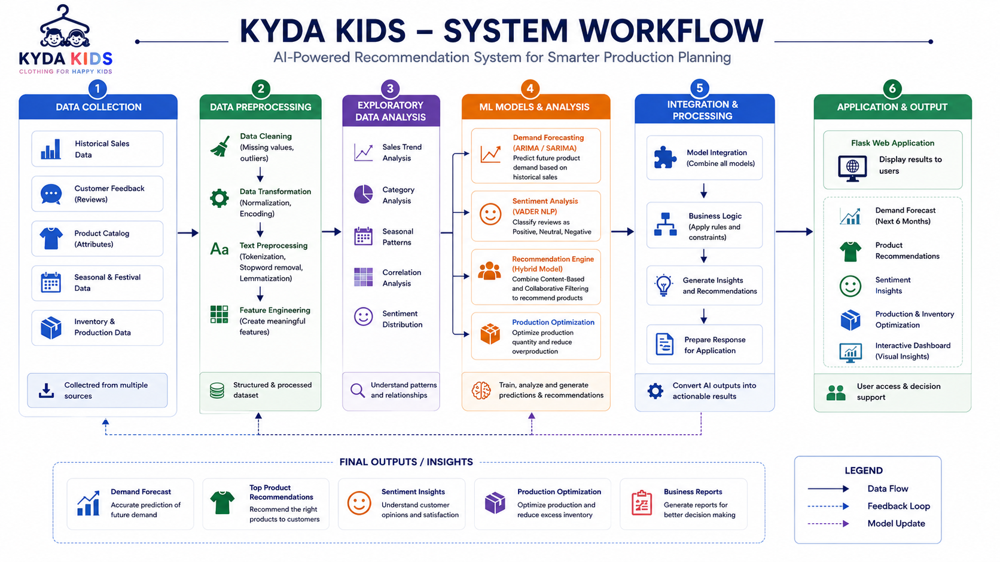
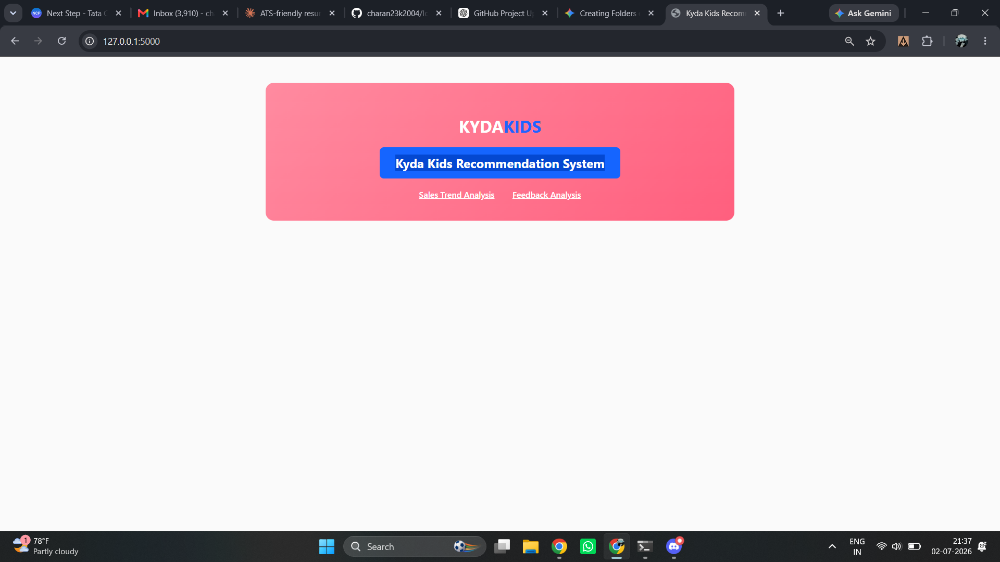
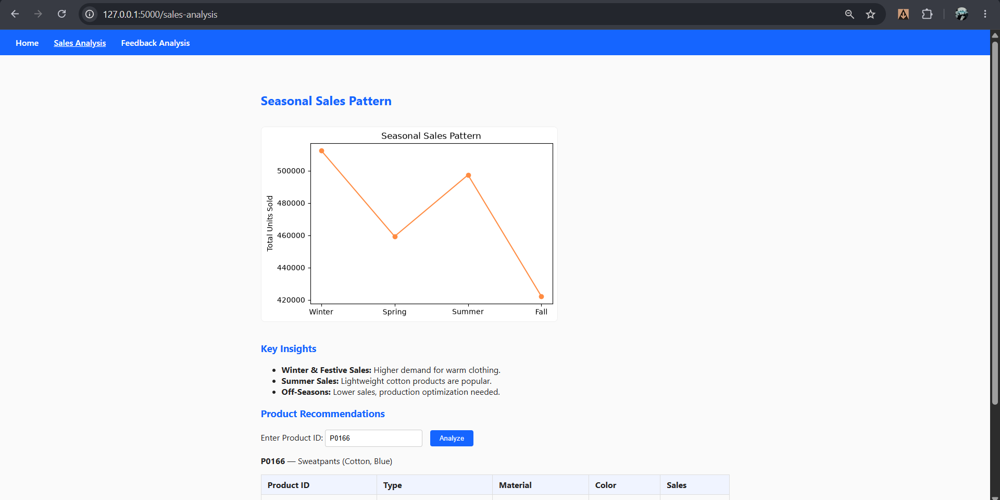
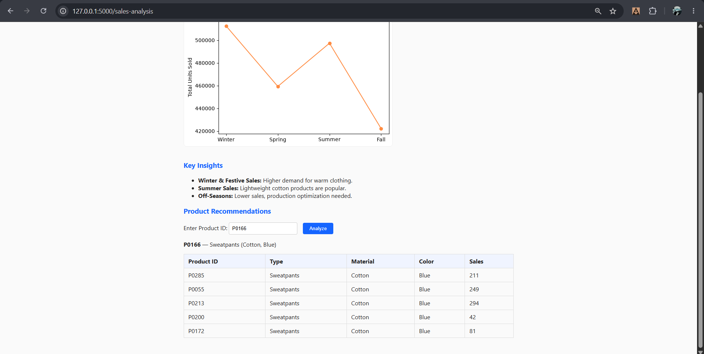
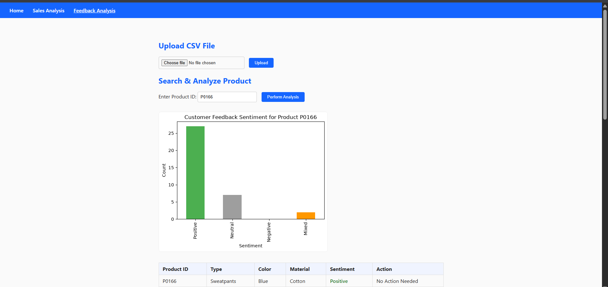
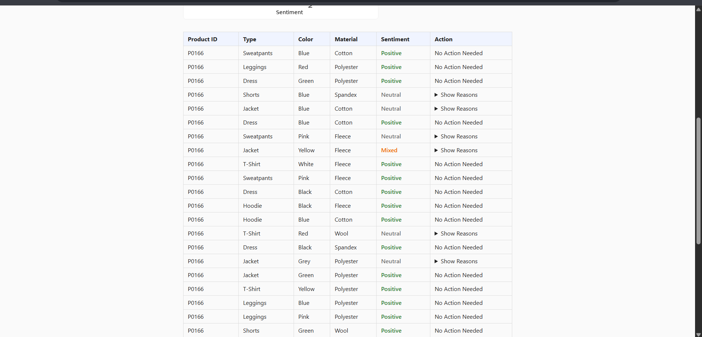

<p align="center">
  
</p>

<h1 align="center">🛍️ Kyda Kids Intelligent Recommendation System</h1>

<p align="center">
AI-Powered Recommendation System for Cost-Effective Production Planning
</p>

<p align="center">


</p>

---

# 📖 Overview

Kyda Kids Intelligent Recommendation System is an AI-powered decision support platform developed to help children's clothing businesses optimize production planning using Machine Learning and Data Analytics.

The application forecasts future product demand, analyzes customer feedback, identifies sales trends, and recommends suitable products through an interactive Flask dashboard.

---

# 🚀 Key Features

- 📈 Demand Forecasting using **ARIMA & SARIMA**
- 💬 Customer Sentiment Analysis using **VADER**
- 🤖 Hybrid Recommendation System
- 👕 Product Recommendation Engine
- 📊 Interactive Flask Dashboard
- 📦 Production Optimization
- 📉 Sales Trend Analysis
- 📋 Customer Feedback Analytics

---

# 💼 Business Problem

Manufacturing companies often face challenges such as:

- Seasonal demand fluctuations
- Excess inventory
- Stock shortages
- Customer dissatisfaction
- Product return rates
- Production planning inefficiencies

This project provides AI-powered insights to support smarter production planning and inventory optimization.

---

# 🛠️ Technology Stack

### Programming Language
- Python

### Backend
- Flask

### Machine Learning
- Scikit-learn

### Forecasting
- ARIMA
- SARIMA

### NLP
- VADER Sentiment Analysis

### Data Processing
- Pandas
- NumPy

### Visualization
- Matplotlib

### Frontend
- HTML
- CSS
- JavaScript

---

# 🏗️ System Architecture

<p align="center">

</p>

---

# 🧠 Machine Learning Pipeline

<p align="center">

</p>

---

# 🔄 Workflow

<p align="center">

</p>

---

# 📂 Dataset

The dataset contains product information including:

- Product ID
- Product Type
- Material
- Color
- Size
- Sales Data
- Production Quantity
- Customer Feedback
- Return Rate
- Season
- Festival Demand Spike

---

# 🤖 Recommendation Engine

The project combines multiple recommendation techniques.

### Content-Based Filtering

Recommends products using product attributes.

### Collaborative Filtering

Generates recommendations based on customer behavior.

### Hybrid Recommendation

Combines Content-Based and Collaborative Filtering for improved recommendation accuracy.

---

# 📈 Demand Forecasting

Demand forecasting is implemented using:

- ARIMA
- SARIMA

These models identify seasonal trends and forecast future demand, helping optimize production planning.

---

# 💬 Customer Sentiment Analysis

Customer reviews are analyzed using **VADER (Valence Aware Dictionary and Sentiment Reasoner)**.

Reviews are classified into:

- 😊 Positive
- 😐 Neutral
- ☹️ Negative

The insights help identify customer satisfaction trends and product quality issues.

---

# 🌐 Dashboard

The Flask dashboard provides:

- Sales Trend Analysis
- Customer Feedback Analytics
- Product Recommendations
- Forecast Results
- Business Insights

---

# 📊 Evaluation Metrics

The recommendation system is evaluated using:

| Metric | Purpose |
|---------|----------|
| Precision@K | Recommendation Accuracy |
| Recall@K | Relevant Recommendation Coverage |
| MRR | Ranking Performance |
| NDCG | Recommendation Quality |
| RMSE | Forecasting Error |

---

# 📸 Project Screenshots

## Dashboard

<p align="center">

</p>

---

## Sales Trend Analysis

<p align="center">

</p>

---

## Sales Trend Analysis (Detailed)

<p align="center">

</p>

---

## Customer Feedback Analysis

<p align="center">

</p>

---

## Customer Feedback Analysis (Detailed)

<p align="center">

</p>

---

# 📁 Repository Structure

```text
Kyda-Kids-Intelligent-Recommendation-System

├── assets/
├── data/
├── docs/
├── models/
├── results/
├── static/
├── templates/
│
├── app.py
├── requirements.txt
├── README.md
├── LICENSE
└── .gitignore
```

---

# ⚙️ Installation

Clone the repository

```bash
git clone https://github.com/charan23k2004/Kyda-Kids-Intelligent-Recommendation-System.git
```

Install dependencies

```bash
pip install -r requirements.txt
```

Run the Flask application

```bash
python app.py
```

Open

```
http://127.0.0.1:5000
```

---

# 🔮 Future Enhancements

- Deep Learning Recommendation Models
- Cloud Deployment
- Mobile Application
- Explainable AI
- User Authentication
- Real-Time Recommendation Engine

---

# 👨‍💻 Team Members

- Charan K
- Naveen S S
- Sachin Karthik V
- Sivaraman S
- Vijayabaskar

---

# 📄 License

This project is licensed under the MIT License.

---

# ⭐ Support

If you found this project useful, please consider giving it a ⭐ on GitHub.
